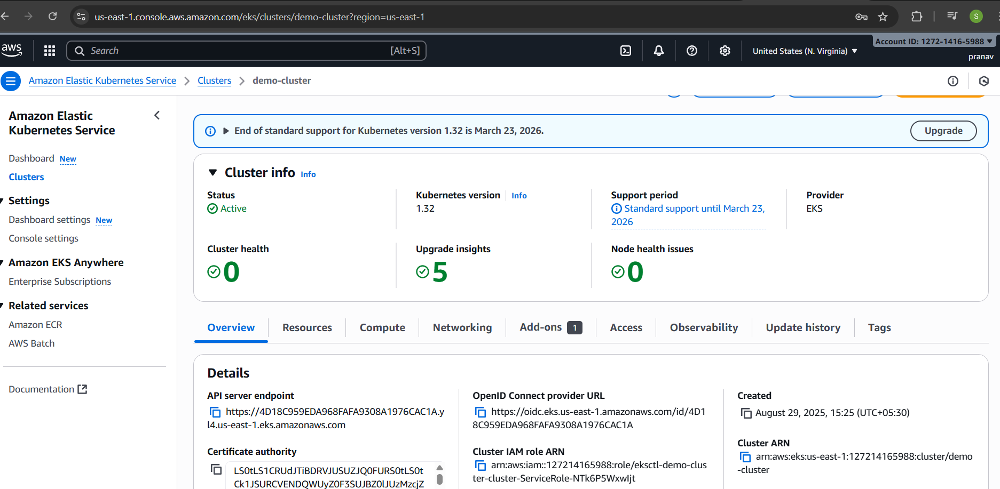
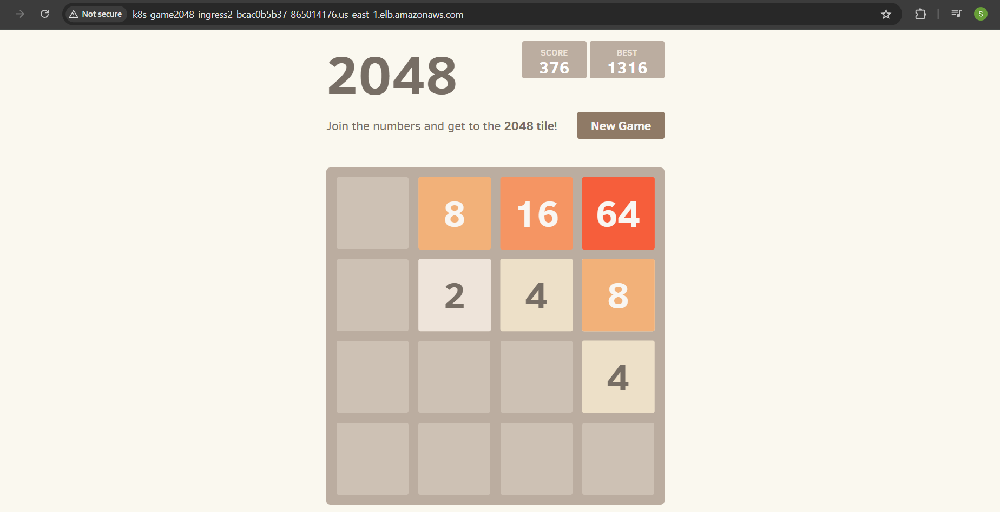

# Project Overview

This project demonstrates deploying the 2048 Game Application on Amazon EKS (Elastic Kubernetes Service) using Kubernetes.
It covers EKS setup, application deployment, and external access via Ingress + Load Balancer.

# Tools & Technologies
* Amazon EKS
  
* Kubernetes (kubectl)

* Ingress Controller

* AWS CLI & eksctl

* YAML Manifests

# Steps Implemented

1.Created an EKS cluster and configured kubectl

2.Deployed the 2048 app using Kubernetes Deployment & Service

3.Configured Ingress Controller for routing external traffic

## Screenshots

### EKS Cluster

### 2048 Game

4.Exposed the app through AWS Load Balancer

5.Verified the 2048 game app on a public endpoint

